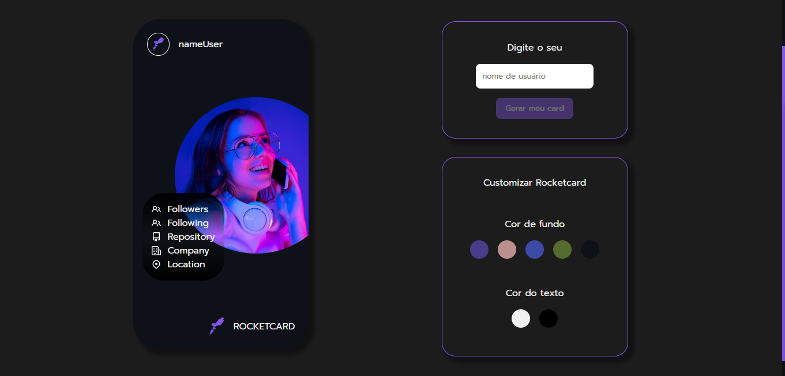

<h1 align="center">Desafio Rocket-card</h1>

<h1 align="center">

</h1>

<h4 align="center">
    Acesse a aplicação online pelo 
    <a href="https://desafio-rocketcard-mu.vercel.app/">link</a>.
<h4>

##  Sobre

O projeto constrói um card com as informações públicas de usuário do GitHub. O usuário informa seu user name e através do consumo da API do GitHub o card é montado com suas informações. As cores do card poderão ser personalizadas, tais como cor de fundo e a cor do texto. Nesse projeto em especial, além de praticar HTML e CSS, destaco o aprendizado com relação à duas funcionalidades. São elas: o formulário não aceitar a escrita de caracteres especiais e a habilitação e desabilitação do botão do formulário, para que não haja requisição à API sem que exista de fato algo digitado previamente pelo usuário. O projeto foi desenvolvido com finalidade didática uma vez que pertence à lista de projetos disponibilizados pela pataforma da Rocketseat como um desafio aos seus alunos no desenvolvimento de suas habilidades frontend. 

---

## Tecnologias usadas

O projeto foi desenvolvido utilizando as seguintes tecnologias:

- HTML5;
- CSS3;
- JavaScript;
- Mobile-first;
- VS Code.

---

## Acesso ao projeto
    - git clone <link-repositório> 
    - cd <diretório>
    - npm install 
    - npm start 
   
---